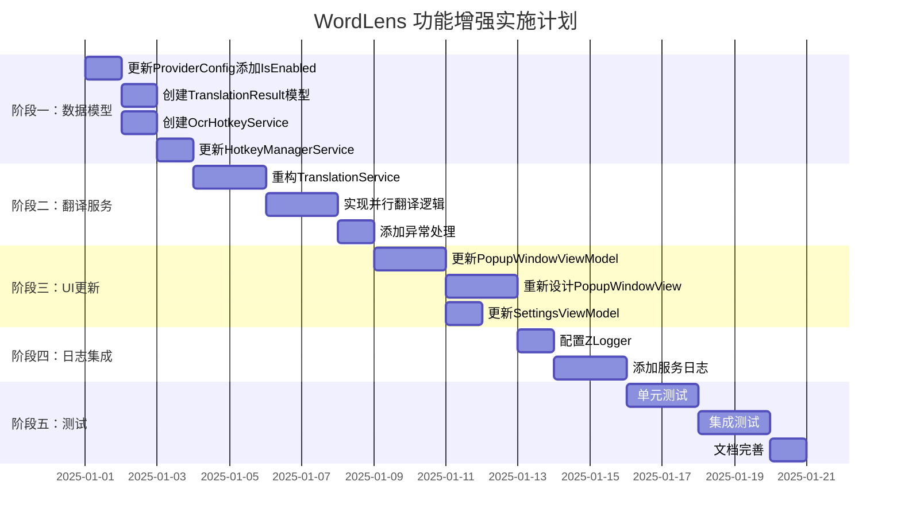
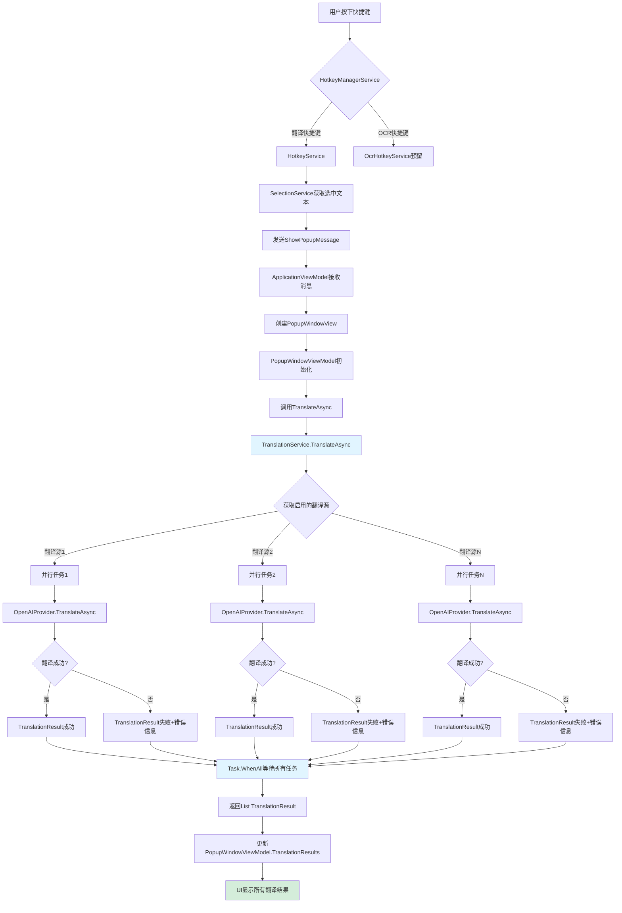
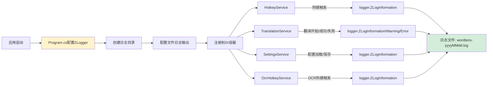
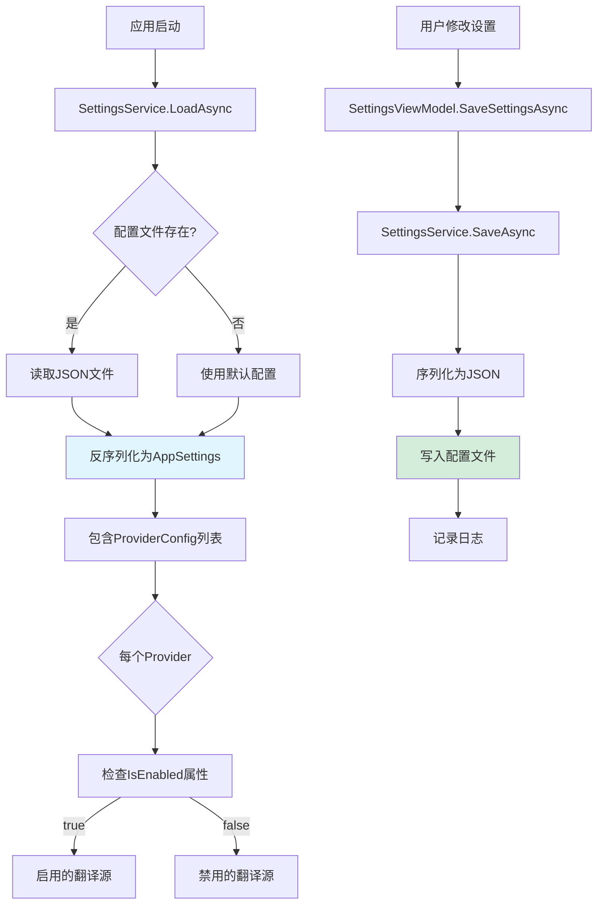
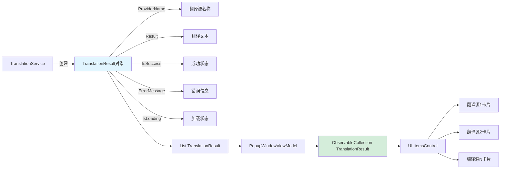
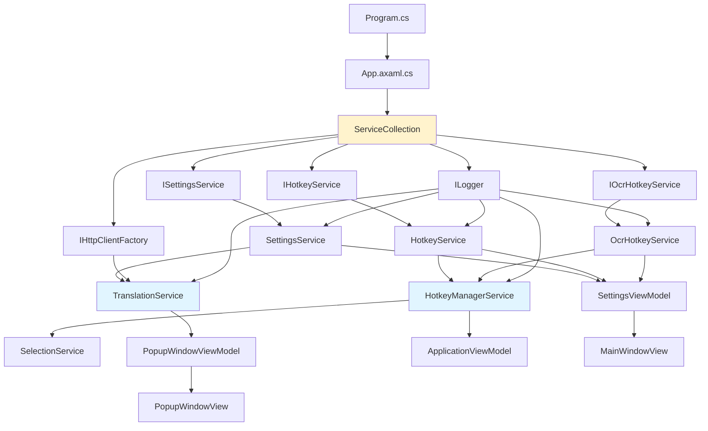
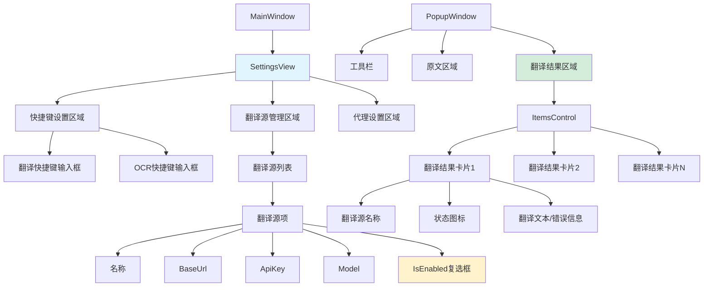

# WordLens 功能实施计划

## 项目时间线

## 架构流程图

### 翻译流程

### 日志记录流程

### 配置管理流程

## 数据流图

### TranslationResult 数据流

## 组件依赖关系

## UI 组件层次结构

## 关键决策点

### 1. 多翻译源实现方式

**选择：并行异步请求（Task.WhenAll）**

优点：
- ✅ 最快的响应速度
- ✅ 用户体验最好
- ✅ 充分利用异步能力

缺点：
- ⚠️ 可能同时产生多个HTTP请求
- ⚠️ 需要处理部分成功的情况

替代方案：
- 串行请求：速度慢，但简单
- 优先级队列：复杂度高

### 2. UI显示方式

**选择：垂直列表（ItemsControl）**

优点：
- ✅ 可以同时看到所有结果
- ✅ 便于对比不同翻译
- ✅ 滚动查看更多结果

缺点：
- ⚠️ 占用更多垂直空间

替代方案：
- TabControl：节省空间，但需要切换标签

### 3. 日志框架

**选择：ZLogger**

优点：
- ✅ 高性能结构化日志
- ✅ 支持异步写入
- ✅ 零分配日志记录
- ✅ 已在项目中使用

### 4. OCR功能

**选择：预留接口，暂不实现**

理由：
- 需要更多时间评估OCR引擎
- 可以在后续版本中添加
- 不影响当前核心功能

## 风险管理

| 风险 | 概率 | 影响 | 缓解措施 |
|------|------|------|----------|
| API限流导致请求失败 | 中 | 中 | 添加重试机制和错误提示 |
| 多个翻译源同时失败 | 低 | 高 | 至少保留一个可用的翻译源 |
| 配置文件损坏 | 低 | 中 | 配置文件备份和验证 |
| 日志文件过大 | 中 | 低 | 实现日志轮转和清理策略 |
| 内存泄漏 | 低 | 高 | 正确处理IDisposable和事件订阅 |

## 成功标准

### 功能性标准
- ✅ OCR热键可以正确捕获和保存
- ✅ 多个翻译源可以并行请求
- ✅ UI正确显示所有翻译结果
- ✅ 翻译源可以单独启用/禁用
- ✅ 日志正确记录到文件

### 性能标准
- ⏱️ 翻译响应时间 < 5秒（单个翻译源）
- ⏱️ UI更新无明显延迟
- 💾 内存使用 < 100MB
- 📝 日志写入不影响主线程

### 质量标准
- 🧪 单元测试覆盖率 > 70%
- 🐛 零已知的Critical Bug
- 📚 完整的技术文档
- 🎨 符合现有UI设计风格

## 下一步行动

准备好开始实施了吗？我建议按以下顺序进行：

1. **先实施数据模型和服务层**（较为独立，风险低）
2. **然后更新UI层**（依赖于服务层）
3. **最后添加日志**（可以逐步添加）

现在可以切换到 Code 模式开始实施代码了！